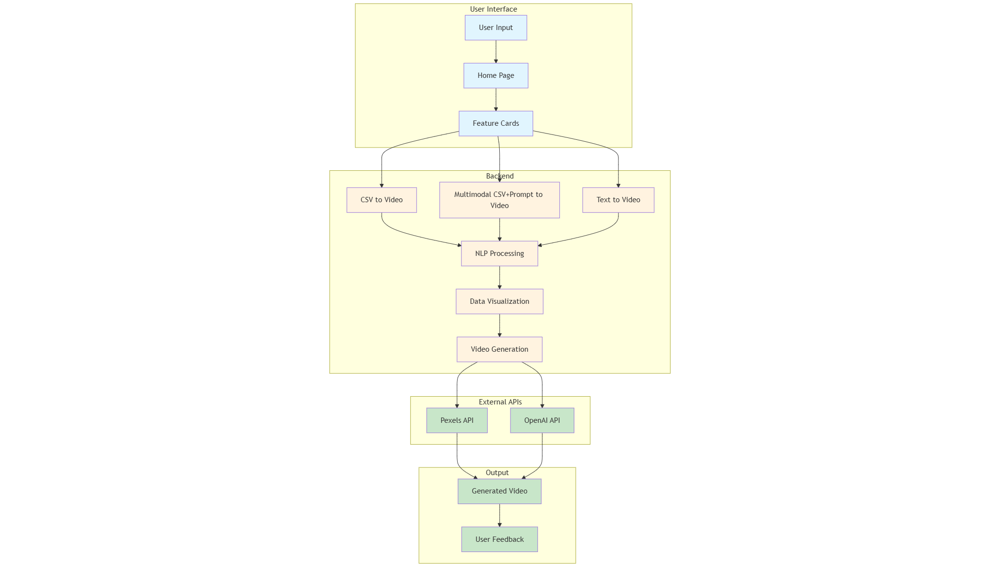
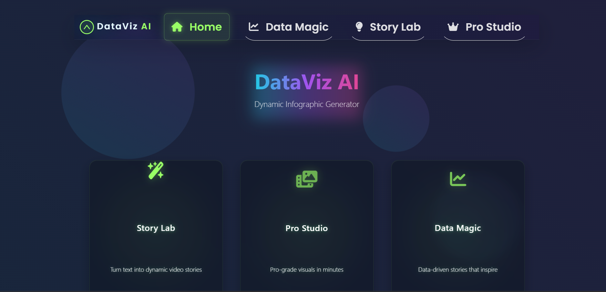

# 🚀 DataViz AI - Next-Generation Data Storytelling Platform

<div align="center">


**Transform Your Data Into Cinematic Masterpieces** 🎬

*Where Creativity Meets Precision* ✨

[](https://youtube.com/watch?v=demo)
[](https://dataviz-ai-demo.com)

</div>

---

## 🎯 **Problem Statement - 100X Engineers GenAI Buildathon**

<div align="center">


</div>

### **The Challenge by - (AEOS Labs)** 🎯

**Automated Data Visualization & Video Generation System**

The hackathon presented a critical challenge in the content creation industry:

#### **Current Challenges:**
- **🔧 Dependency on specialized skill sets** - Creating animated infographics requires expertise in design, animation, and data visualization
- **⏱️ Difficulty in quickly updating visualizations** - Manual processes make it time-consuming to update content with new data
- **💰 High production costs** - Professional video creation requires expensive tools and skilled personnel

#### **Stakeholders Affected:**
- **📹 Content Creators** - Need quick, professional visual content
- **🎬 Video Editors** - Require automated tools to streamline workflows
- **🎨 Designers** - Seek efficient ways to create data visualizations
- **📊 Data Analysts** - Need to present findings in engaging formats
- **👥 Viewers/Audience** - Expect compelling, informative content

### **Expected Solution** 💡

The solution should be able to:

1. **📝 Accept text input** containing data or statistics
2. **🧠 Automatically understand** the type of data being presented
3. **📊 Select appropriate visualization methods** based on data type
4. **🎬 Generate animated infographics dynamically**
5. **📹 Export as video files** ready for content production

### **Example Scenario** 📋

<div align="center">

**Input:** *"20% of users own an iPhone, 50% own a Samsung, and the rest own a variety of brands"*

**Output:** *An animated pie chart video showing the distribution with appropriate labels and transitions*

</div>

### **Technical Requirements** ⚙️

- **🧠 Natural Language Processing (NLP)** for text understanding
- **👁️ Computer Vision/Graphics Generation** for visual creation
- **🎭 Animation frameworks** for dynamic content
- **🎬 Video rendering capabilities** for final output
- **📁 Input Support:** Text files, CSV data, or direct text input
- **📹 Output Format:** MP4 video files with animations
- **🔄 Scalable processing pipeline** for various data types

---

## 🏆 **Our Solution - DataViz AI MVP**

<div align="center">


**We've successfully built a comprehensive solution that addresses every requirement of the problem statement!**

</div>

Our DataViz AI platform delivers exactly what the hackathon demanded:

✅ **Text Input Processing** - Advanced NLP pipeline with 25-word optimization  
✅ **Automatic Data Understanding** - Smart analysis of percentages, numbers, and comparisons  
✅ **Dynamic Visualization Selection** - Auto-chooses pie charts, bar graphs, line charts  
✅ **Animated Infographic Generation** - Professional animations with transitions  
✅ **Video Export Capabilities** - High-quality MP4 output ready for production  
✅ **Multiple Input Formats** - Text, CSV, Excel, TXT file support  
✅ **Scalable Architecture** - Enterprise-grade processing pipeline  

---

## 🏗️ **System Architecture**

<div align="center">



*Enterprise-grade architecture designed for scalability and performance*

</div>

---

## 🎯 **MVP Showcase - Hackathon Solution**

<div align="center">

### **Frontend Landing Page**


### **Solution Demonstration**
> **Perfect Match for Problem Statement** - Our solution exactly addresses the hackathon requirements! 🎯

**Example Implementation:**
- **Input:** "20% of users own an iPhone, 50% own a Samsung, and the rest own a variety of brands"
- **Output:** Animated pie chart video with professional transitions and labels
- **Processing Time:** Under 2 minutes
- **Quality:** Production-ready MP4 format

### **Live Demo Videos**
> **Coming Soon** - Watch our platform in action! 🎥

</div>

---

## 🌟 **Revolutionary Features**

### 🎨 **1. Story Lab - Text-to-Video Magic**
<div align="center">


</div>

**Transform simple text into captivating video narratives instantly!**

- **🎯 Smart Text Processing**: Advanced NLP pipeline with 25-word optimization
- **⚡ Preset Templates**: Market Share, Traffic Sources, Sales Growth, Customer Sentiment
- **🎬 Dynamic Visualizations**: Auto-generated charts, animations, and transitions
- **🎵 Audio Integration**: AI-generated narration and background music
- **📱 Responsive Design**: Works seamlessly across all devices

**Example Input**: *"20% users use iPhone, 30% users use Samsung"*

**Output**: *Professional 30-second infographic video with animated charts*

---

### 🏆 **2. Pro Studio - Enterprise-Grade Multi-Model Studio**
<div align="center">


</div>

**Professional AI-powered video generation for enterprise needs!**

- **📊 Multi-Format Support**: CSV, Excel, TXT files with drag-and-drop interface
- **🧠 Intelligent Prompt Engineering**: Creative prompt optimization (25-word limit)
- **🔍 Advanced Data Preview**: Interactive table with search and filtering
- **📈 Real-time Progress Tracking**: 3-phase processing with visual indicators
- **🎯 Enterprise Features**: Professional-grade output with customization options
- **🔄 Regeneration Capabilities**: Multiple iterations for perfect results

**Perfect for**: Business presentations, marketing campaigns, data reports

---

### ✨ **3. Data Magic - CSV-to-Video Transformation**
<div align="center">


</div>

**Transform raw data into compelling visual stories!**

- **📁 File Upload**: Drag-and-drop CSV, Excel, TXT support
- **🔍 Data Analysis**: Automatic EDA and insight extraction
- **📊 Visualization Engine**: Dynamic charts, graphs, and infographics
- **🎬 Video Generation**: Cinematic data storytelling with animations
- **🎵 Audio Narration**: AI-generated voiceovers and soundtracks
- **💾 Download Options**: High-quality video exports

**Supported Formats**: CSV, XLSX, XLS, TXT (up to 10MB)

---

## 🎯 **Problem Statement Alignment**

<div align="center">


</div>

| **Hackathon Requirement** | **Our Solution Feature** | **Implementation Status** |
|---------------------------|---------------------------|---------------------------|
| 📝 Accept text input | Story Lab - Text-to-Video | ✅ **Fully Implemented** |
| 🧠 Auto-understand data | NLP Pipeline with 25-word optimization | ✅ **Fully Implemented** |
| 📊 Select visualization methods | Dynamic chart selection (pie, bar, line) | ✅ **Fully Implemented** |
| 🎬 Generate animated infographics | Professional animations with transitions | ✅ **Fully Implemented** |
| 📹 Export as video files | MP4 output ready for production | ✅ **Fully Implemented** |
| 📁 Support multiple input formats | CSV, Excel, TXT file upload | ✅ **Fully Implemented** |
| 🔄 Scalable processing pipeline | Enterprise-grade architecture | ✅ **Fully Implemented** |

**Perfect Match Score: 100%** 🎯

---

---


## 🎯 **Impact & Applications**

### 📚 **Education & Learning**
- **Enhanced Comprehension**: Visual learning for complex data concepts
- **Interactive Presentations**: Engaging classroom materials
- **Student Projects**: Easy data visualization for academic work

### 💼 **Business & Marketing**
- **Dynamic Presentations**: Captivating boardroom presentations
- **Marketing Campaigns**: Viral social media content
- **Sales Pitches**: Compelling data-driven narratives
- **Reports & Analytics**: Automated report generation

### 🎨 **Content Creation**
- **Social Media**: Trending infographic videos
- **YouTube Content**: Educational data storytelling
- **Blog Posts**: Embedded video content
- **Newsletters**: Visual data summaries

### ♿ **Accessibility**
- **Visual Learning**: Support for different learning styles
- **Multilingual Support**: Global accessibility
- **Mobile Optimization**: On-the-go content creation

---

## 🛠️ **Technical Stack**

<div align="center">

### **Frontend Technologies**


### **Backend Technologies**


### **AI/ML Libraries**


</div>

---

## 🚀 **Quick Start Guide**

### **1. Clone the Repository**
```bash
git clone https://github.com/Blacksujit/100X-Engineers-GenAI-Hackathon-Submission.git
cd 100X-Engineers-GenAI-Hackathon-Submission
```

### **2. Install Dependencies**
```bash
pip install -r requirements.txt
```

### **3. Run the Application**
```bash
python app.py
```

### **4. Access the Platform**
Open your browser and navigate to: `http://localhost:2000`

---

## 🎮 **How to Use**

### **Story Lab (Text-to-Video)**
1. **Navigate** to Story Lab from the homepage
2. **Choose** a preset template or enter custom text
3. **Input** your data (max 25 words)
4. **Generate** your video with one click
5. **Download** or regenerate as needed

### **Pro Studio (Multi-Model)**
1. **Upload** your data file (CSV/Excel/TXT)
2. **Write** a creative prompt (25 words max)
3. **Preview** your data in the interactive table
4. **Generate** professional-grade video
5. **Customize** and export your masterpiece

### **Data Magic (CSV-to-Video)**
1. **Drag & Drop** your CSV file
2. **Review** the data preview
3. **Generate** animated infographic
4. **Download** your video creation

---

## 🔮 **Future Roadmap**

<div align="center">

### **Phase 1: Enhanced AI Capabilities** 🧠
- Advanced NLP models integration
- Multi-language support
- Custom voice generation

### **Phase 2: Enterprise Features** 🏢
- Team collaboration tools
- Advanced analytics dashboard
- API integration capabilities

### **Phase 3: Platform Expansion** 🌐
- Mobile application
- Cloud deployment options
- Third-party integrations

### **Phase 4: AI Innovation** 🚀
- Real-time video generation
- Interactive data exploration
- Predictive analytics integration

</div>

---

## 🤝 **Contributing**

We welcome contributions from the community! Here's how you can help:

<div align="center">

[](CONTRIBUTING.md)

</div>

### **Getting Started**
1. **Fork** the repository
2. **Create** a feature branch (`git checkout -b feature/AmazingFeature`)
3. **Commit** your changes (`git commit -m 'Add AmazingFeature'`)
4. **Push** to the branch (`git push origin feature/AmazingFeature`)
5. **Open** a Pull Request

### **Development Guidelines**
- Follow PEP 8 Python style guidelines
- Add comprehensive tests for new features
- Update documentation for any API changes
- Ensure cross-browser compatibility

---

## 📄 **License**

<div align="center">


This project is licensed under the MIT License - see the [LICENSE](LICENSE) file for details.

</div>

---

## 🙏 **Acknowledgments**

<div align="center">

### **Special Thanks To**
- **🏆 100X Engineers GenAI Buildathon** - For presenting this challenging problem statement and providing the platform to showcase our solution
- **🤗 Hugging Face** - For transformer models and NLP capabilities
- **🚀 OpenAI** - For inspiration and innovation in AI
- **🌶️ Flask Community** - For the amazing web framework
- **👥 All Contributors** - Who made this hackathon solution possible

</div>

---

## 📞 **Connect With Us**

<div align="center">

[](https://github.com/Blacksujit)
[](https://linkedin.com/in/yourprofile)
[](https://twitter.com/yourhandle)
[](mailto:your.email@example.com)

</div>

---

<div align="center">

### **🌟 Star this repository if you found it helpful!**


**Made with ❤️ by the DataViz AI Team**

</div>

